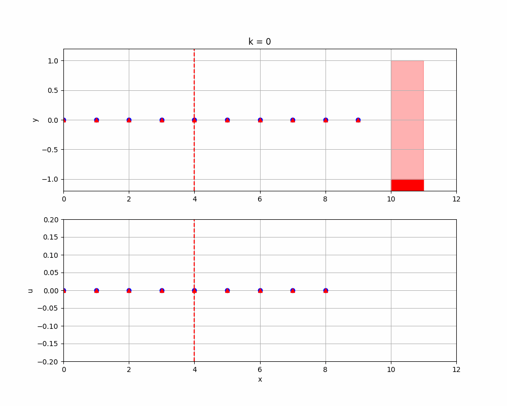

# DecisionPlanning
The repository implements some decision-making and contingency planning methods.

If you find this work useful or interesting, please kindly give me a star ⭐, thanks!😀


### Requirements

- **System:** Ubuntu 20.04 (Tested on Win11 WSL2 )
- **Python 3.8.10:** numpy == 1.24.4 matplotlib == 3.7.4 casadi == 3.6.5


## Contingency MPC / Contingency Planning

### How to run

- Navigate to the root folder

- Uncomment the corresponding code block of settings in `ContingencyMPC/CMPC.py` (enable `CMPC - obstacle pops out` as follows)
  ```python
  # CMPC - obstacle pops out
  obs_pop = True
  Pc = 0.25        # Cost weight for contingency control
  
  # # CMPC - obstacle does not pop out
  # obs_pop = False
  # Pc = 1e-2       # for unique minimum solution
  
  # # RMPC
  # obs_pop = False
  # Pc = 1.0 - 1e-2   
  ```

- Run the script `python3 ContingencyMPC/CMPC.py`

- The anime and figures are saved in `ContingencyMPC/log/`

### Results

- CMPC - obstacle pops out (at k = 4)
  - at k = 5, the nominal planner observes this movement and recognizes the contingency has occurred



- CMPC - obstacle pops out (at k=4)


- RMPC
  - assumes the worst case evolution of the scene (follow the contingency planner, the red triangles), even though the obstacle never pops out


### Reference

- Alsterda, John P. and J. Christian Gerdes. “Contingency Model Predictive Control for Linear Time-Varying Systems.” *ArXiv* abs/2102.12045 (2021): n. pag.
- Alsterda, John P., Matthew Brown and J. Christian Gerdes. “Contingency Model Predictive Control for Automated Vehicles.” *2019 American Control Conference (ACC)* (2019): 717-722.
